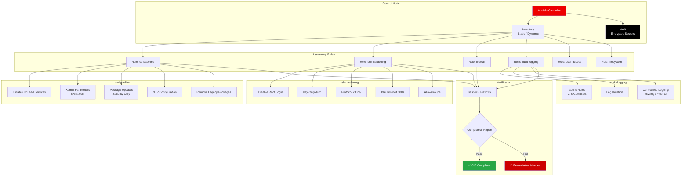

<div align="center">

# Ansible Hardening Playbooks

**CIS Benchmark-aligned security hardening for RHEL, CentOS, Ubuntu, and Debian**

[](https://www.ansible.com/)
[](https://www.redhat.com/)
[](https://ubuntu.com/)
[](https://www.cisecurity.org/cis-benchmarks)
[](LICENSE)
[](https://devopsdispatch.beehiiv.com)

*Used to harden 500+ servers across banking, government, and telecom in the UAE and Egypt.*

</div>

---

## The Problem

Security auditors hand you a 300-page CIS benchmark PDF. You have 200 servers to harden. The deadline is next week.

Manual hardening is slow, error-prone, and impossible to verify at scale. These playbooks automate CIS Level 1 and Level 2 controls with toggles for every rule so you can skip controls that break your applications.

---

## Architecture Overview



---

## Roles

| Role | CIS Controls | Description |
|------|-------------|-------------|
| `os-baseline` | 1.x, 3.x | Kernel params, service hardening, package cleanup |
| `ssh-hardening` | 5.2.x | SSH server configuration, key-only auth, timeouts |
| `firewall` | 3.5.x | firewalld / iptables rules, default deny |
| `audit-logging` | 4.1.x | auditd rules, log integrity, centralized logging |
| `user-access` | 5.x, 6.x | Password policies, sudo config, account lockout |
| `filesystem` | 1.1.x | Mount options, partition checks, tmp hardening |

---

## Quick Start

### 1. Clone the repo

```bash
git clone https://github.com/maziz00/ansible-hardening.git
cd ansible-hardening
```

### 2. Configure your inventory

```ini
# inventory/production.ini
[webservers]
web-01.example.com
web-02.example.com

[databases]
db-01.example.com

[all:vars]
ansible_user=deploy
ansible_become=yes
```

### 3. Review and customize controls

```yaml
# group_vars/all.yml — Toggle individual CIS controls
cis_level: 1                          # 1 = Level 1, 2 = Level 1 + Level 2

# SSH
cis_sshd_allow_groups: ["sshusers"]   # Groups allowed to SSH
cis_sshd_max_auth_tries: 4
cis_sshd_permit_root_login: "no"
cis_sshd_password_auth: "no"          # Key-only authentication

# Audit
cis_auditd_max_log_file: 8            # MB
cis_auditd_space_left_action: email

# Firewall
cis_firewall_default_zone: drop
cis_firewall_allowed_services:
  - ssh
  - https

# Skip specific controls that break your apps
cis_skip_rules:
  - "1.1.10"   # Skip /tmp noexec (breaks some build systems)
  - "5.2.18"   # Skip SSH MaxSessions (need tunneling)
```

### 4. Run the playbook

```bash
# Dry run first — always
ansible-playbook site.yml -i inventory/production.ini --check --diff

# Apply hardening
ansible-playbook site.yml -i inventory/production.ini

# Run specific role only
ansible-playbook site.yml -i inventory/production.ini --tags ssh-hardening
```

### 5. Verify compliance

```bash
# Generate compliance report
ansible-playbook verify.yml -i inventory/production.ini

# Output: JSON report per host with pass/fail per CIS control
```

---

## MENA Compliance Context

These playbooks are aligned with requirements from:

- **UAE NESA** (National Electronic Security Authority) information assurance standards
- **Saudi NCA** (National Cybersecurity Authority) Essential Cybersecurity Controls
- **PDPL** (Personal Data Protection Law) data handling on servers
- **Banking regulators** (CBUAE, SAMA) infrastructure security baselines

The CIS benchmark covers the technical controls. These playbooks map CIS rules to local compliance frameworks through the `compliance-mapping.yml` reference.

---

## Project Structure

```
ansible-hardening/
├── site.yml                    # Main playbook — runs all roles
├── verify.yml                  # Compliance verification playbook
├── ansible.cfg
├── inventory/
│   ├── production.ini
│   ├── staging.ini
│   └── group_vars/
│       ├── all.yml             # Global hardening defaults
│       ├── webservers.yml      # Web-specific overrides
│       └── databases.yml       # DB-specific overrides
├── roles/
│   ├── os-baseline/
│   │   ├── tasks/main.yml
│   │   ├── handlers/main.yml
│   │   ├── defaults/main.yml
│   │   └── templates/
│   ├── ssh-hardening/
│   ├── firewall/
│   ├── audit-logging/
│   ├── user-access/
│   └── filesystem/
├── compliance-mapping.yml      # CIS → NESA/NCA/PDPL mapping
├── LICENSE
└── README.md
```

---

## Supported Platforms

| OS | Versions | CIS Benchmark | Tested |
|----|----------|---------------|--------|
| RHEL | 8.x, 9.x | CIS RHEL 8/9 | Yes |
| CentOS Stream | 8, 9 | CIS RHEL 8/9 | Yes |
| Rocky Linux | 8.x, 9.x | CIS RHEL 8/9 | Yes |
| AlmaLinux | 8.x, 9.x | CIS RHEL 8/9 | Yes |
| Ubuntu | 22.04, 24.04 | CIS Ubuntu 22.04 | Yes |
| Debian | 11, 12 | CIS Debian 11 | Yes |

---

## Safety Features

- **`--check --diff` first** always dry-run before applying
- **`cis_skip_rules` list** skip any control that breaks your application
- **Idempotent** safe to run multiple times
- **Tagged roles** apply only the hardening you need (`--tags ssh-hardening`)
- **Backup before modify** original config files backed up to `/etc/ansible-backup/`

---

## About Me

**Mohamed AbdelAziz** — Senior DevOps Architect
12 years securing enterprise Linux infrastructure from bare-metal racks to cloud VMs.

- [LinkedIn](https://www.linkedin.com/in/maziz00/) | [Medium](https://medium.com/@maziz00) | [Upwork](https://www.upwork.com/freelancers/maziz00) | [Consulting](https://calendly.com/maziz00/devops)

---

## License

MIT — use freely. If these playbooks save your team audit prep time, a star is appreciated.
